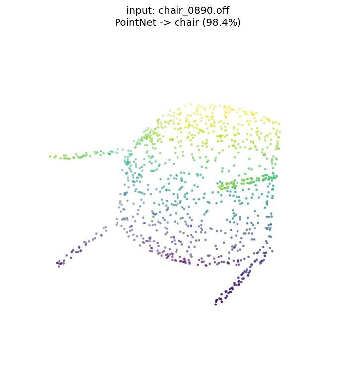
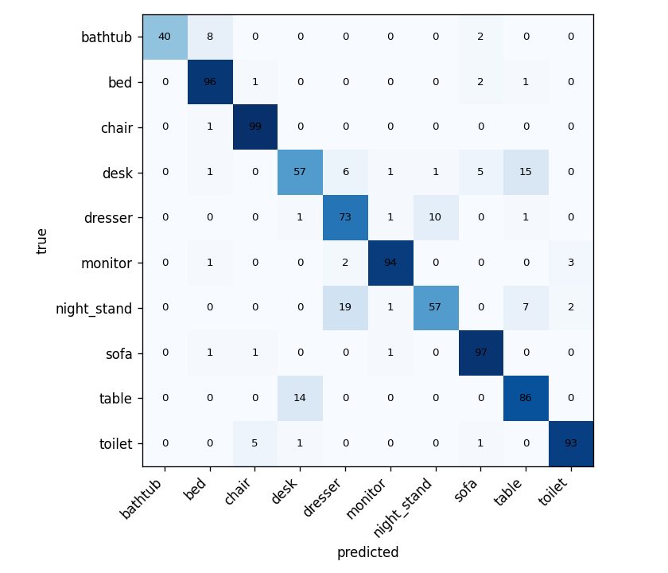
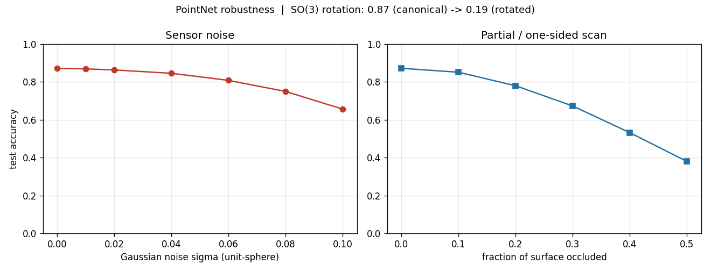
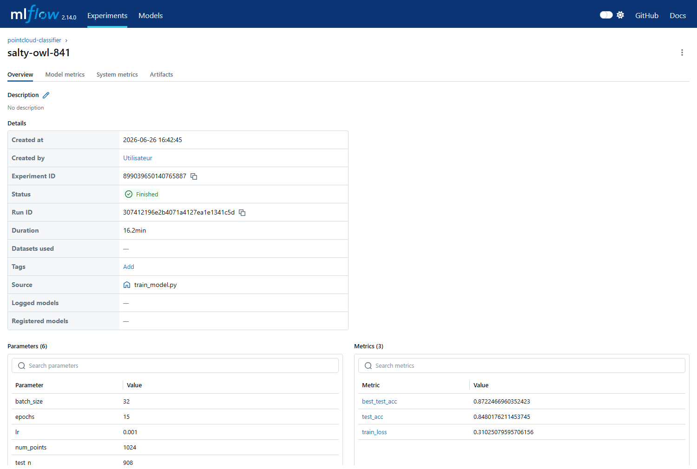

# 3D Point-Cloud Classifier (PointNet)

[](https://github.com/Airohh/pointnet-3d-classifier/actions/workflows/ci.yml)
[](LICENSE)
[](https://www.python.org/)

Classify 3D CAD meshes from their geometry alone. A mesh (`.off`, `.ply`,
`.stl`, `.obj`) is sampled into a point cloud, normalised, and fed to a
**PointNet** network that is invariant to point order and to rigid pose. The
model is trained on **ModelNet10** and served through a **FastAPI** endpoint —
the same way a 3D model would be plugged into a backend in production.

> Built to demonstrate the full path *raw 3D geometry → robust model →
> production API*: deep learning on unstructured 3D data, then industrialised
> (tests, MLflow, Docker, CI).

---

## Demo

End-to-end on a held-out ModelNet10 chair: the mesh is sampled into the
1024-point cloud the network actually sees, then classified.



```bash
curl -F "file=@chair_0890.off" http://localhost:8000/predict
# {"prediction": "chair", "confidence": 0.986,
#  "top_k": [{"label": "chair", ...}, {"label": "toilet", ...}, {"label": "bed", ...}]}
```

Reproduce the figure with `python scripts/demo_figure.py`, or explore
interactively (mesh upload + 3D viewer) with `python scripts/run_dashboard.py`.

---

## Why point clouds (and why PointNet)

3D parts come as meshes or scans — unordered sets of points in space. A naive
network can't consume them: there is no grid (unlike images) and the **N!
orderings of N points must all give the same answer**. PointNet solves this
with two ideas:

1. **Symmetric aggregation** — a per-point MLP followed by a global
   `max-pool`. Because `max` is order-independent, the global feature is
   invariant to point permutation. *(Verified in `tests/test_model.py::test_permutation_invariance`.)*
2. **Learned spatial alignment (T-Net)** — two small sub-networks predict a
   3×3 input transform and a 64×64 feature transform that re-pose the object
   into a canonical frame, so the classifier is robust to how the part was
   oriented. The feature transform is kept near-orthogonal with a regulariser.

---

## Architecture

```
mesh (.off/.ply/.stl/.obj)
   │  area-weighted surface sampling  → 1024 points
   │  center + unit-sphere scale       (scale invariance)
   ▼
input T-Net (3×3)  →  align
   ▼
shared MLP (64) → feature T-Net (64×64) → shared MLP (128, 1024)
   ▼
global max-pool  → 1024-d shape descriptor      (permutation invariance)
   ▼
FC (512 → 256 → 10) + dropout
   ▼
softmax over 10 CAD categories
```

Code map:

| File | Role |
|------|------|
| `src/pointcloud_clf/model.py` | PointNet: `TNet`, `PointNetEncoder`, `PointNetClassifier`, orthogonality regulariser |
| `src/pointcloud_clf/data.py` | mesh → point cloud sampling, normalise, augment, cached `Dataset` |
| `src/pointcloud_clf/train.py` | training loop + MLflow tracking + per-class eval |
| `src/pointcloud_clf/predict.py` | load-once inference helper |
| `src/pointcloud_clf/api.py` | FastAPI service (`/predict`, `/health`, `/classes`) |
| `src/pointcloud_clf/dashboard.py` | Streamlit demo (upload mesh, 3D viewer) |
| `scripts/train_model.py`, `evaluate.py` | train + per-class eval / confusion matrix |
| `scripts/robustness.py` | noise / occlusion / SO(3)-rotation sweeps |
| `scripts/train_so3.py` | retrain with SO(3) aug, fix rotation robustness |
| `scripts/ablation.py` | component ablation (feature T-Net, augmentation) |
| `scripts/benchmark.py`, `export_onnx.py` | latency/throughput · ONNX export + parity |
| `scripts/ood_demo.py` | out-of-distribution / calibration probe |
| `tests/` | model, data, API (run without the dataset) |

---

## Results

ModelNet10 test split (908 meshes), PointNet trained from scratch on CPU,
15 epochs. **Overall test accuracy: 0.872.**

<!-- RESULTS -->
Per-class accuracy (sorted):

| class | acc | | class | acc |
|-------|-----|-|-------|-----|
| chair | 0.99 | | dresser | 0.85 |
| sofa | 0.97 | | bathtub | 0.80 |
| bed | 0.96 | | desk | 0.66 |
| monitor | 0.94 | | night_stand | 0.66 |
| toilet | 0.93 | | table | 0.86 |



**Failure analysis.** The two weak classes are geometric near-duplicates of
others: `desk` ↔ `table` (both flat-topped slabs on legs) and
`night_stand` ↔ `dresser` (both rectangular boxes). The confusion matrix
confirms the errors concentrate there, not randomly — the network learns
shape, so shapes that *are* similar get confused. Strong classes (`chair`
0.99, `sofa` 0.97) have distinctive silhouettes.

### Robustness — behaviour under real scan conditions

A clean test number says nothing about production, where parts are scanned
noisily, seen from one side, and arrive in any pose. `scripts/robustness.py`
perturbs every test cloud and re-measures accuracy.



| stress | result |
|--------|--------|
| **Gaussian noise** (sensor jitter) | graceful: 0.872 → 0.846 at σ=0.04, → 0.66 at σ=0.10. Tolerates mild noise. |
| **Occlusion** (one-sided / partial scan) | steeper: 0.872 → 0.78 at 20 % dropped, → 0.38 at 50 %. Partial geometry is the harder failure mode. |
| **SO(3) rotation** (arbitrary pose) | collapses: 0.872 → **0.19**. |

The rotation collapse is the **honest, known limitation** of PointNet: the
input T-Net helps but does *not* make the network rotation-invariant, and this
model was trained with **yaw-only** augmentation. Under arbitrary 3D rotation
the input is out-of-distribution.

**The fix — and its cost.** `scripts/train_so3.py` retrains PointNet with full
**SO(3)** augmentation and re-measures (`reports/rotation_fix.json`):

| training augmentation | canonical acc | random SO(3) acc |
|-----------------------|:-------------:|:----------------:|
| yaw-only (baseline)   | **0.872**     | 0.191            |
| full SO(3)            | 0.641         | **0.592**        |

Rotated accuracy recovers **0.19 → 0.59 (≈3×)**: the model is now roughly
pose-agnostic (canonical and rotated accuracy are close, 0.64 vs 0.59).
The price is lower clean accuracy — full-rotation invariance is a genuinely
harder learning problem, and 15 CPU epochs do not fully close the gap. The
right operating point depends on the deployment: yaw-only if parts arrive
upright, SO(3) if pose is unconstrained. Knowing the limit, fixing it, and
quantifying the trade-off is the point — not a single headline number.

### Ablation — what each component buys

`scripts/ablation.py` retrains at identical epochs/seed with pieces removed:

| configuration | clean test acc |
|---------------|:--------------:|
| full (feature T-Net + augmentation) | 0.865 |
| − feature T-Net | **0.891** |
| − augmentation | 0.889 |

Read honestly: on the **clean, canonically-posed** test set, removing the 64×64
feature T-Net or the augmentation slightly *raises* accuracy — they cost
capacity/regularisation that the easy in-distribution split doesn't need. That
is the wrong axis to judge them on. Their value shows up under stress: the
augmentation is what keeps the model usable off the canonical pose (see the
SO(3) result above), and the feature transform regularises the learned
alignment. The lesson: **judge a component on the metric it targets
(robustness), not the headline number** — clean accuracy alone would wrongly
tell you to delete both.

### Calibration / out-of-distribution

`scripts/ood_demo.py` feeds shapes that are *not* ModelNet10 furniture
(sphere, torus, cone, cylinder). The softmax head must still pick one of its 10
classes, and does so with misleading confidence — e.g. a **torus → "bathtub"
at 0.76**. Mean confidence on these OOD shapes is ~0.55. The lesson for
production: threshold / abstain (or add an explicit "unknown" class) rather
than trusting raw softmax.

### Inference performance (CPU)

`scripts/benchmark.py` — the model is **3.46 M params / 13.9 MB**, small
enough to serve on CPU with no accelerator:

| batch | ms / sample | samples / s |
|:-----:|:-----------:|:-----------:|
| 1     | ~2.9        | ~350        |
| 4     | ~2.1        | ~483        |
| 32    | ~3.4        | ~299        |

Single-mesh latency is **~3 ms** on CPU — comfortably real-time for an
interactive API; small batches improve throughput (~480 samples/s at batch 4).
(Numbers vary with host/threads/load; measure on an idle machine — see
`reports/benchmark.json`.)

---

## Quickstart

```bash
pip install -r requirements.txt

# 1. dataset (~450 MB, cached after first run)
python scripts/download_data.py

# 2. train  (full run; use --limit for a fast smoke test)
python scripts/train_model.py --epochs 15
python scripts/train_model.py --epochs 5 --limit 40 --no-mlflow   # quick

# 3. evaluate (per-class accuracy + confusion matrix)
python scripts/evaluate.py

# 4. analysis & industrialisation
python scripts/robustness.py     # noise / occlusion / rotation sweeps
python scripts/train_so3.py      # rotation-robust retrain (fix)
python scripts/ablation.py       # component ablation
python scripts/benchmark.py      # CPU latency / throughput
python scripts/export_onnx.py    # ONNX export + parity + speedup
python scripts/ood_demo.py       # calibration on out-of-distribution shapes

# 5. serve
uvicorn pointcloud_clf.api:app --reload      # http://localhost:8000/docs
python scripts/run_dashboard.py              # Streamlit demo (mesh upload + 3D viewer)
```

Predict from the API:

```bash
curl -F "file=@some_part.off" http://localhost:8000/predict
# {"prediction": "chair", "confidence": 0.94, "top_k": [...]}
```

---

## Industrialisation

- **Tests** — `pytest` covers model shapes, permutation invariance, the
  data transforms, and the API contract. They run **without** the 450 MB
  dataset (synthetic trimesh primitives), so CI stays fast.
- **MLflow** — every run logs params, per-epoch loss/accuracy and the best
  checkpoint, so results are tracked and reproducible:

  
- **Docker** — CPU-only image; `docker compose up` brings up the API + an
  MLflow server.
- **CI** — GitHub Actions runs ruff + pytest on every push.
- **ONNX export** — `scripts/export_onnx.py` exports the model to
  `models/pointnet.onnx` and **verifies torch ↔ ONNX Runtime parity**
  (max abs diff < 1e-3, argmax identical). The point is **portability**: any
  application can run inference via ONNX Runtime — C++, C#, Node, edge — with no
  PyTorch dependency. On latency the two are comparable here (~3 ms torch vs
  ~4 ms ORT, batch=1): this model is small enough that eager PyTorch is already
  fast and ORT's graph overhead doesn't pay off on CPU — a speedup would need a
  bigger model, batching, or quantisation. Honest measurement, not a headline.
- **Performance** — 3.46 M params / 13.9 MB, ~4 ms/sample on CPU
  (`scripts/benchmark.py`).
- **Model card** — `models/MODEL_CARD.md`: data, metrics, known limits, repro.

## Design decisions

- **trimesh, not Open3D** — lighter, pure-Python install, enough for
  area-weighted surface sampling; avoids a heavy native dependency in CI/Docker.
- **Sampled clouds are cached to `.npy`** — surface sampling is the slow step;
  caching makes epochs I/O-cheap.
- **Same normalisation at train and serve** — the API runs the identical
  center+unit-sphere transform, so there is no train/serve skew.
- **Domain note** — ModelNet10 is furniture, but the pipeline is
  category-agnostic: retrain on a catalogue of industrial parts and the same
  code classifies them. The contribution here is the *geometry → model → API*
  machinery, not the specific labels.

---

## Stack

PyTorch · trimesh · NumPy · FastAPI · MLflow · ONNX Runtime · Streamlit · Docker · pytest · ruff · GitHub Actions
